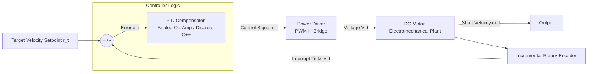

# P16: DC Motor PID Control (Analog & Embedded)

## Executive Overview
Achieving precise speed and position control over highly non-linear electromechanical systems is the cornerstone of modern robotics and industrial CNC machinery. This repository consolidates the rigorous engineering, mathematical modeling, and dual-implementation prototyping of a **DC Motor Closed-Loop Proportional-Integral-Derivative (PID) Controller**. It juxtaposes the classical continuous-time approach utilizing pure **Analog Op-Amp Computing** against the modern discrete-time approach leveraging **Embedded C++ Microcontrollers** and Interrupt Service Routines (ISRs).

> [!WARNING]
> **Electromechanical Safety & Drive Limits Callout**
> Implementing closed-loop motor control introduces significant hazards. **Motor Runaway:** If the feedback sensor (encoder) disconnects, the PID error integrates to infinity, driving the motor to absolute maximum velocity. **Inductive Kickback:** High-frequency PWM switching of inductive coils generates massive transient voltage spikes; robust Back-EMF flyback diodes must be present across the H-Bridge terminals. **Thermal Overload:** Continuous stall-currents will catastrophically overheat the L298N/BTS7960 drivers if proper current-limiting and heatsinking are not applied.

## System Highlights
- **Dual Implementation Comparison**: Side-by-side design and validation of a pure Analog Op-Amp PID architecture versus a Discrete Embedded PID architecture.
- **Multi-Topology Rotary Encoder Decoding**: Real-time position tracking logic written for high-resolution Optical Encoders (E6B2-CWZ3E), Magnetic Hall-Effect Quadrature Encoders, and Single-channel optocouplers.
- **Real-Time Interrupt-Driven Feedback**: Utilizes hardware interrupts (`attachInterrupt()`) for deterministic pulse counting, ensuring zero missed ticks at high RPMs.
- **Dynamic Compensator Tuning**: Implements tunable parameters ($K_p$, $K_i$, $K_d$) to critically damp the step response and reject external load disturbances.

## System Architecture Diagram

## Theoretical & Mathematical Models

### 1. DC Motor Electromechanical Plant Transfer Function
The standard second-order linear model bridging the electrical time constants ($L/R$) and mechanical time constants ($J/b$) of a brushed DC motor is defined in the Laplace domain as:
$$G(s) = \frac{\Omega(s)}{V(s)} = \frac{K_t}{(J s + b)(L s + R) + K_t K_e}$$
*(Where $J$ is rotor inertia, $b$ is viscous friction, $K_t$ is the torque constant, and $K_e$ is the back-EMF constant).*

### 2. Ideal Continuous PID Transfer Function
The analog representation of the PID compensator operates continuously in time:
$$C(s) = K_p + \frac{K_i}{s} + K_d s = \frac{K_d s^2 + K_p s + K_i}{s}$$

### 3. Discrete Velocity PID Formulation (Backward Euler)
For the embedded microcontroller to execute the calculus, it must be discretized. Using a backward difference approximation at sampling interval $T_s$:
$$u[k] = u[k-1] + K_p(e[k] - e[k-1]) + K_i T_s e[k] + \frac{K_d}{T_s}(e[k] - 2e[k-1] + e[k-2])$$

### 4. Quadrature Optical Encoder Angular Velocity Estimation
Decoding a 2-channel quadrature signal utilizing $4\times$ decoding yields maximum resolution. The discrete angular velocity ($\omega$) in radians per second is:
$$\omega = \frac{2\pi \cdot \Delta \text{ticks}}{4 \cdot \text{PPR} \cdot \Delta t} \quad [\text{rad/s}]$$

### 5. Analog Op-Amp PID Circuit Equations
In the analog architecture, the PID terms are synthesized physically using Operational Amplifiers:
- **Proportional**: $V_p = -\frac{R_f}{R_{in}} V_e$
- **Integral**: $V_i = -\frac{1}{R C} \int V_e dt$
- **Derivative**: $V_d = -R C \frac{dV_e}{dt}$
*(These three signals are then fed into a final inverting summing amplifier to generate the control voltage).*

## Engineering Trade-off Table: Analog vs. Digital PID

| Parameter | Analog Op-Amp PID | Digital Embedded PID (C++) |
| :--- | :--- | :--- |
| **Parameter Tuning** | Tedious. Requires physically swapping resistors/capacitors or tuning potentiometers. | Instant. Changed via software variables or serial commands. |
| **Drift & Aging** | High. Capacitors dry out and resistors change value with temperature drift. | Zero. Mathematics do not drift over time or temperature. |
| **Latency & Sampling** | Absolute zero latency (Continuous time). Infinite resolution. | Constrained by ADC conversion times and the Nyquist sampling rate ($T_s$). |
| **Implementation Flexibility** | Rigid. Only performs the specific PID topology hardwired on the PCB. | Highly flexible. Can easily add anti-windup, feed-forward, and dead-band logic. |

## Pinout & Hardware Allocation Table (Embedded Architecture)
| Pin Designation | Component / Function | Notes |
| :--- | :--- | :--- |
| **D2 (INT0)** | Encoder Phase A | Hardware interrupt for tick counting |
| **D3 (INT1)** | Encoder Phase B | Hardware interrupt for quadrature direction |
| **D9 (PWM)** | H-Bridge ENA / ENB | Timer1 16-bit PWM output for velocity control |
| **D7, D8** | H-Bridge IN1 / IN2 | Motor direction logic |
| **A0 (ADC)** | Velocity Setpoint | 10k$\Omega$ Potentiometer mapping $0-1023$ |

## Authentic Artifacts Catalog
- **Source Code**: [`src/embedded/`](src/embedded/) contains all Arduino C++ encoder and PID logic.
- **Engineering Reports & Telemetry**: [`docs/`](docs/) holds the theoretical derivations, formal proposals, and `.csv` step-response logs.
- **Prototype Evidence**: [`docs/images/`](docs/images/) contains **[ORIGINAL SYSTEM ARTIFACTS]** including waveform captures and physical breadboard wiring.

---

**Hassan Moqbel Morshed Ghaleb**
Mechatronics Engineer | Mechanical Design & CAD (SolidWorks & AutoCAD) | Preventive Maintenance & Electromechanical Systems | Industrial Automation, Control Systems, Robotics & Intelligent Machines | CAD/FEA, Embedded Systems, Python & C++
[GitHub](https://github.com/Hassan-Moqbel) · [Facebook](https://www.facebook.com/share/1BqxAgVjHi/) · [LinkedIn](https://www.linkedin.com/in/hassan-moqbel)

## License
This project is licensed under the [MIT License](LICENSE).
